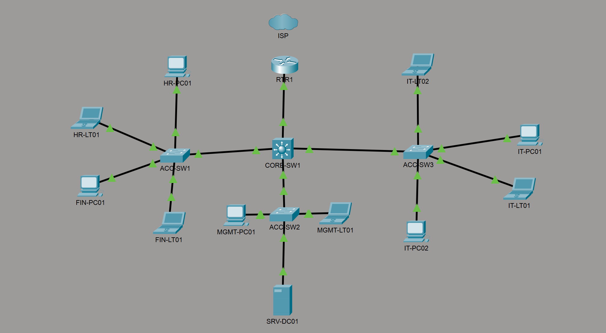

# Cisco Enterprise Networking Lab

## Overview

This project demonstrates the design, implementation, and documentation of a simulated enterprise network using Cisco Packet Tracer. The lab replicates a small business environment and focuses on core networking concepts including VLANs, inter-VLAN routing, DHCP, Access Control Lists (ACLs), switch security, static routing, and Cisco IOS administration.

---

## Business Scenario

Robinson Technology Solutions is a fictional small business that requires a secure, scalable, and segmented network infrastructure. The network is designed to support multiple departments while providing centralized services through a Windows Server 2022 domain controller.

Departments include:

- Management
- Human Resources
- Finance
- Information Technology
- Server Infrastructure

---

## Enterprise Network Topology

---

## Project Progress

### ✅ Phase 1 – Network Design

Completed:

- Designed the enterprise network topology in Cisco Packet Tracer
- Implemented a hierarchical network architecture
- Added an ISP, edge router, core multilayer switch, and access switches
- Organized departmental endpoints
- Added a Windows Server 2022 host to represent enterprise infrastructure
- Established the GitHub repository structure
- Uploaded the initial network topology
- Configured Git for version control and documentation

---

## Technologies

- Cisco Packet Tracer
- Cisco IOS
- Layer 2 Switching
- Layer 3 Switching
- VLANs
- Inter-VLAN Routing
- DHCP
- ACLs
- Static Routing
- Git
- GitHub

---

## Project Status

🟡 In Progress

**Current Phase:** Network Design

**Next Phase:** Basic Device Configuration and VLAN Implementation