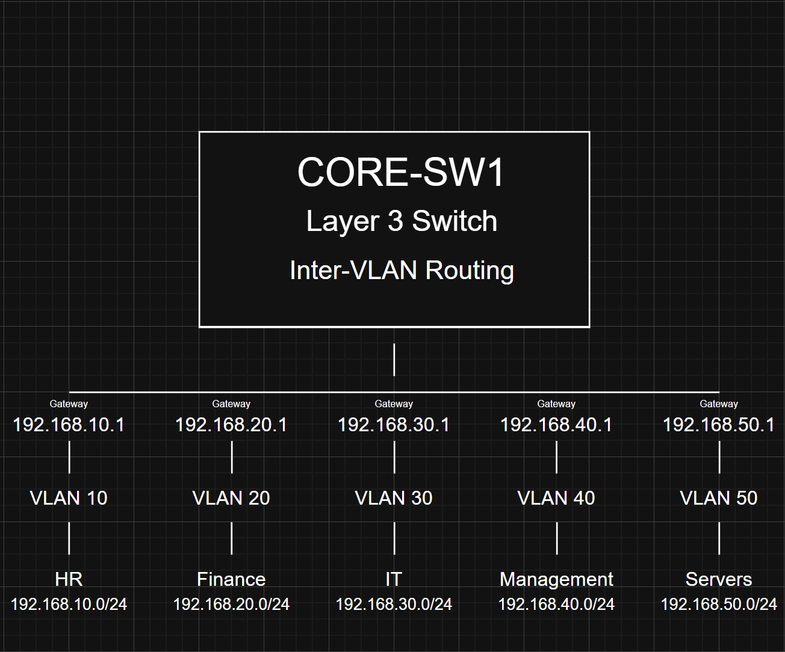
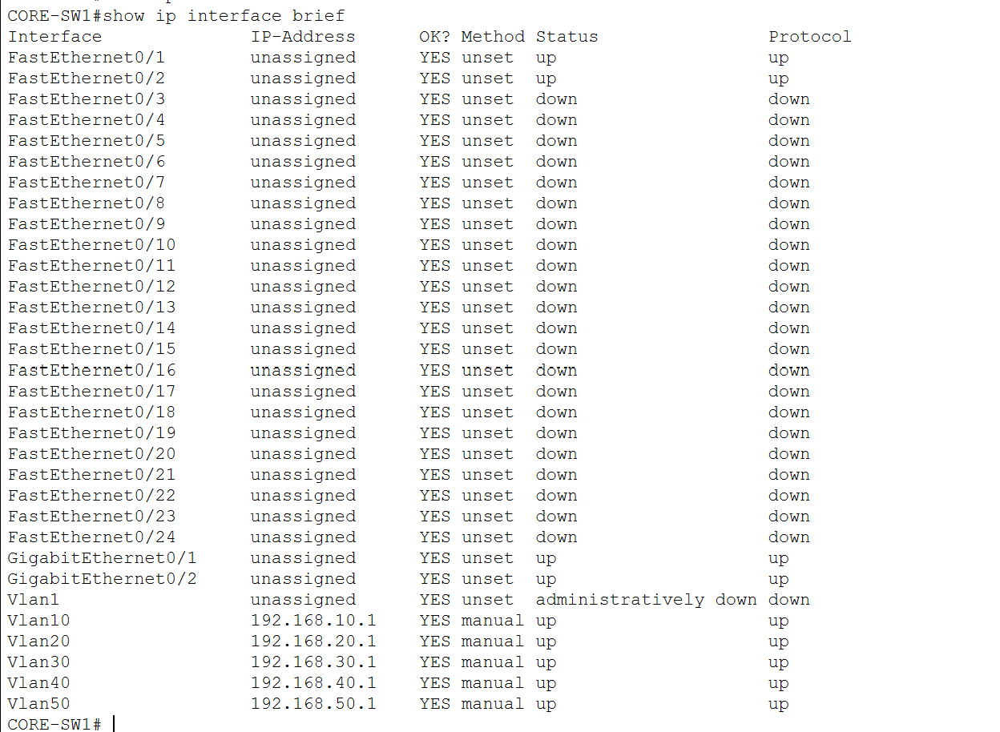

# Inter-VLAN Routing

## Overview

This document describes the implementation of Inter-VLAN Routing within the enterprise network.

Each department resides in its own VLAN and IPv4 subnet. Because VLANs are separate Layer 2 broadcast domains, devices in different VLANs cannot communicate without a Layer 3 device.

A Cisco Catalyst 3560 multilayer switch (CORE-SW1) performs Layer 3 routing using Switch Virtual Interfaces (SVIs), allowing communication between all authorized VLANs while maintaining logical network separation.

---

# Objectives

The goals of the Inter-VLAN Routing implementation were to:

- Enable communication between separate VLANs
- Configure Layer 3 routing on the core switch
- Configure Switch Virtual Interfaces (SVIs)
- Configure default gateways for each VLAN
- Verify end-to-end connectivity
- Support centralized enterprise services such as DHCP

---

# Layer 3 Switch

CORE-SW1 serves as both the Layer 2 switching device and the Layer 3 routing device for the enterprise network.

Responsibilities include:

- Routing traffic between VLANs
- Hosting Switch Virtual Interfaces (SVIs)
- Acting as the default gateway for each subnet
- Maintaining the routing table
- Relaying DHCP requests to the centralized DHCP server

---

# Switch Virtual Interfaces (SVIs)

Each VLAN was assigned an SVI that functions as the default gateway for devices within that subnet.

| VLAN | Department | Gateway |
|------:|------------|----------------|
| 10 | Human Resources | 192.168.10.1 |
| 20 | Finance | 192.168.20.1 |
| 30 | Information Technology | 192.168.30.1 |
| 40 | Management | 192.168.40.1 |
| 50 | Servers | 192.168.50.1 |

---

# IP Routing

Layer 3 routing was enabled using:

```cisco
ip routing
```

Once enabled, CORE-SW1 routes packets between all configured VLANs.

Without IP routing, communication would only be possible between devices located in the same VLAN.

---

# Routing Process

When a device communicates with another VLAN, the following occurs:

1. The source device determines the destination is outside its local subnet.
2. The packet is forwarded to the device's default gateway (SVI).
3. CORE-SW1 examines the destination IP address.
4. The routing table is consulted.
5. The packet is forwarded to the destination VLAN.
6. The destination device processes the packet and returns a reply.

This process occurs entirely within the multilayer switch.

---

# DHCP Relay Integration

After Inter-VLAN Routing was implemented, centralized DHCP services were added to the enterprise network.

Because DHCP broadcasts cannot cross VLAN boundaries, DHCP Relay was configured on each client VLAN SVI using:

```cisco
ip helper-address 192.168.50.10
```

Configured VLANs:

- VLAN 10
- VLAN 20
- VLAN 30
- VLAN 40

The `ip helper-address` command forwards DHCP broadcast requests to the DHCP server located on VLAN 50 while continuing to provide normal Layer 3 routing between VLANs.

---

# Default Gateway Assignment

Each endpoint uses the SVI within its subnet as its default gateway.

| Department | Default Gateway |
|------------|-----------------|
| Human Resources | 192.168.10.1 |
| Finance | 192.168.20.1 |
| Information Technology | 192.168.30.1 |
| Management | 192.168.40.1 |
| Servers | 192.168.50.1 |

---

# Verification

The following Cisco IOS commands were used to verify Layer 3 routing.

```cisco
show ip interface brief

show ip route

show running-config
```

Verification confirmed:

- All SVIs operational
- Correct gateway addresses
- IP routing enabled
- Connected routes installed
- DHCP Relay configured
- Successful Inter-VLAN communication

---

# Connectivity Testing

Connectivity testing confirmed successful communication between VLANs.

Example tests included:

| Source | Destination | Result |
|---------|-------------|--------|
| HR-PC01 | FIN-PC01 | Success |
| HR-PC01 | IT-PC01 | Success |
| HR-PC01 | MGMT-PC01 | Success |
| HR-PC01 | SRV-DC01 | Success |
| IT-PC01 | SRV-DC01 | Success |
| MGMT-PC01 | FIN-PC01 | Success |

Successful ping responses confirmed that CORE-SW1 was correctly routing traffic between all enterprise VLANs.

---

# Routing Diagram

The following diagram illustrates the logical routing architecture used by the enterprise network.



---

# Verification Screenshots

## Layer 3 Interfaces

```markdown

```

---

## Routing Table

```markdown

```

---

## Inter-VLAN Connectivity

```markdown

```

---

# Design Benefits

Implementing Inter-VLAN Routing on a Layer 3 switch provides:

- High-speed routing between VLANs
- Reduced network latency
- Simplified network architecture
- Centralized gateway management
- Support for centralized services such as DHCP
- Improved scalability
- Enterprise-ready design

---

# Conclusion

Inter-VLAN Routing was successfully implemented using a Cisco Catalyst 3560 multilayer switch.

Switch Virtual Interfaces (SVIs) provide the default gateway for every department while IP routing enables communication between isolated VLANs. After implementing DHCP Relay using `ip helper-address`, the same Layer 3 infrastructure also supports centralized DHCP services located on the Server VLAN.

This architecture provides a scalable and efficient enterprise design that supports future services such as DNS, Active Directory, Access Control Lists (ACLs), and advanced network security.