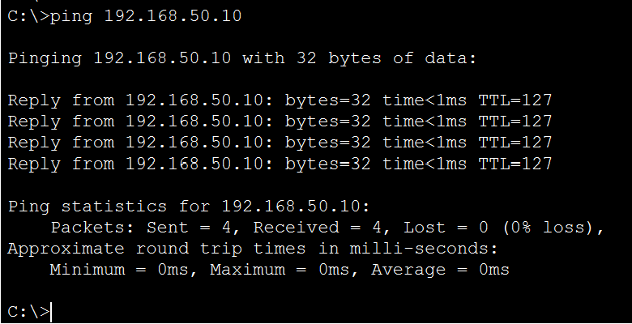

# Inter-VLAN Routing

## Overview

This document describes the implementation of Inter-VLAN Routing within the enterprise network.

Since each department is assigned to its own VLAN, devices located in different VLANs cannot communicate through Layer 2 switching alone. To enable communication between departments, the Cisco Catalyst 3560 multilayer switch (CORE-SW1) performs Layer 3 routing using Switch Virtual Interfaces (SVIs).

This implementation provides efficient routing between VLANs while eliminating the need for a traditional Router-on-a-Stick configuration.

---

# Objectives

The goals of the Inter-VLAN Routing implementation were to:

- Enable communication between separate VLANs
- Configure Layer 3 routing on the core switch
- Configure default gateways for every VLAN
- Verify end-to-end connectivity
- Prepare the network for enterprise services such as DHCP and Active Directory

---

# Layer 3 Switch

The Cisco Catalyst 3560 multilayer switch (CORE-SW1) performs both Layer 2 switching and Layer 3 routing.

Responsibilities include:

- Routing traffic between VLANs
- Hosting Switch Virtual Interfaces (SVIs)
- Acting as the default gateway for every subnet
- Maintaining the routing table

---

# Switch Virtual Interfaces (SVIs)

An SVI is a virtual Layer 3 interface associated with a VLAN.

Each VLAN was assigned an SVI that serves as the default gateway for devices within that subnet.

| VLAN | Department | Gateway |
|------:|------------|---------|
| 10 | Human Resources | 192.168.10.1 |
| 20 | Finance | 192.168.20.1 |
| 30 | Information Technology | 192.168.30.1 |
| 40 | Management | 192.168.40.1 |
| 50 | Server Infrastructure | 192.168.50.1 |

---

# IP Routing

Layer 3 routing was enabled on CORE-SW1 using the Cisco IOS command:

```cisco
ip routing
```

Enabling IP routing allows the multilayer switch to forward packets between different VLANs.

Without this command, communication would only be possible within the same VLAN.

---

# Routing Process

When a device communicates with another device located in a different VLAN, the following process occurs:

1. The source device sends traffic to its default gateway.
2. The SVI on CORE-SW1 receives the packet.
3. CORE-SW1 consults its routing table.
4. The packet is forwarded to the destination VLAN.
5. The destination device receives the packet.

This routing process is performed entirely by the multilayer switch.

---

# Default Gateway Assignment

Each endpoint was configured to use the SVI within its own subnet as the default gateway.

| Department | Default Gateway |
|------------|-----------------|
| Human Resources | 192.168.10.1 |
| Finance | 192.168.20.1 |
| Information Technology | 192.168.30.1 |
| Management | 192.168.40.1 |
| Server Infrastructure | 192.168.50.1 |

---

# Verification

The following Cisco IOS commands were used to verify the Layer 3 configuration.

```cisco
show ip interface brief

show ip route

show running-config
```

Verification confirmed:

- All SVIs configured
- Gateway interfaces operational
- IP routing enabled
- Connected routes installed
- Inter-VLAN communication functioning correctly

---

# Connectivity Testing

Connectivity testing was performed between devices located in different VLANs.

Successful tests included:

| Source | Destination | Result |
|----------|-------------|--------|
| HR-PC01 | HR-LT01 | Success |
| HR-PC01 | FIN-PC01 | Success |
| HR-PC01 | IT-PC01 | Success |
| HR-PC01 | MGMT-PC01 | Success |
| HR-PC01 | SRV-DC01 | Success |
| IT-PC01 | SRV-DC01 | Success |
| MGMT-PC01 | FIN-PC01 | Success |

Successful ping responses confirmed that routing between VLANs was functioning correctly.

---

# Verification Screenshots

Add the following screenshots.

## Gateway Interfaces

```text
images/verification/show-ip-interface-brief.png
```

Markdown:

```markdown

```

---

## Routing Table

```text
images/verification/show-ip-route.png
```

Markdown:

```markdown

```

---

## Successful Ping Test

```text
images/verification/inter-vlan-ping.png
```

Markdown:

```markdown

```

---

# Design Benefits

Using a Layer 3 switch for Inter-VLAN Routing provides several advantages.

- High-performance routing
- Simplified network architecture
- Reduced latency
- Centralized gateway management
- Easy scalability
- Better support for enterprise services
- Eliminates Router-on-a-Stick bottlenecks

---

# Summary

Inter-VLAN Routing was successfully implemented using the Cisco Catalyst 3560 multilayer switch.

Each VLAN received its own Switch Virtual Interface (SVI), allowing the switch to function as the default gateway for every department. After enabling IP routing and configuring the gateway interfaces, devices in different VLANs were able to communicate successfully, providing full end-to-end connectivity throughout the enterprise network.
