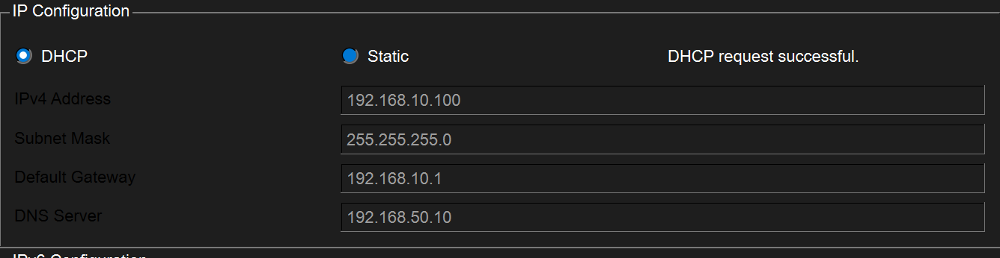
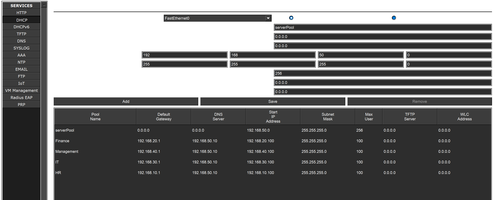
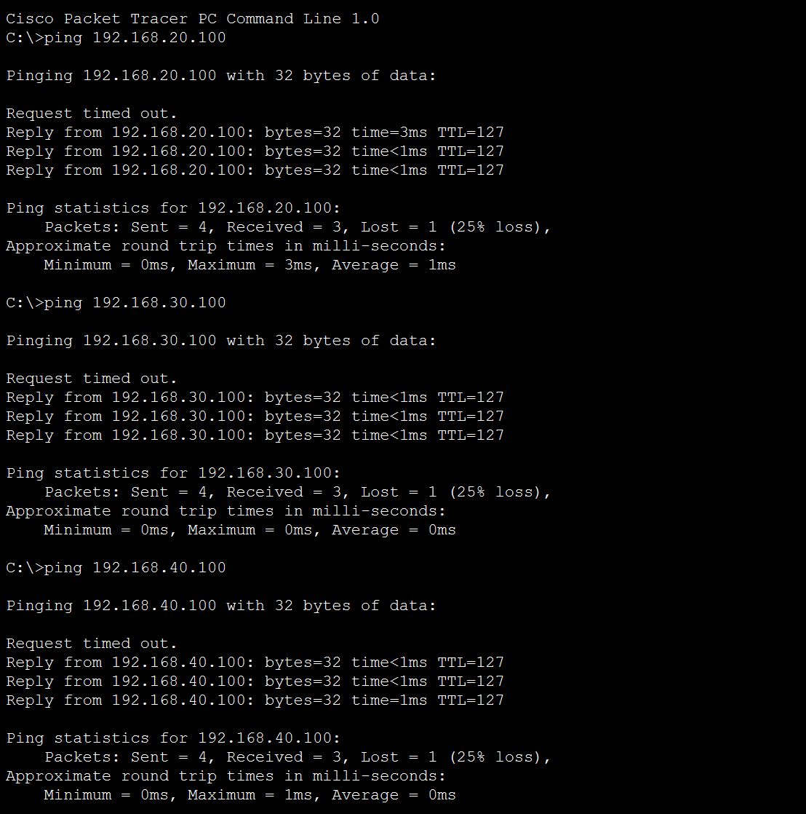
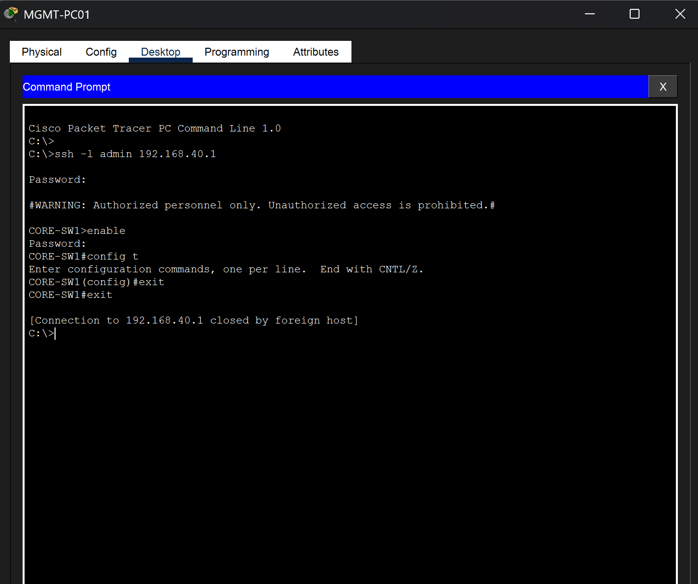
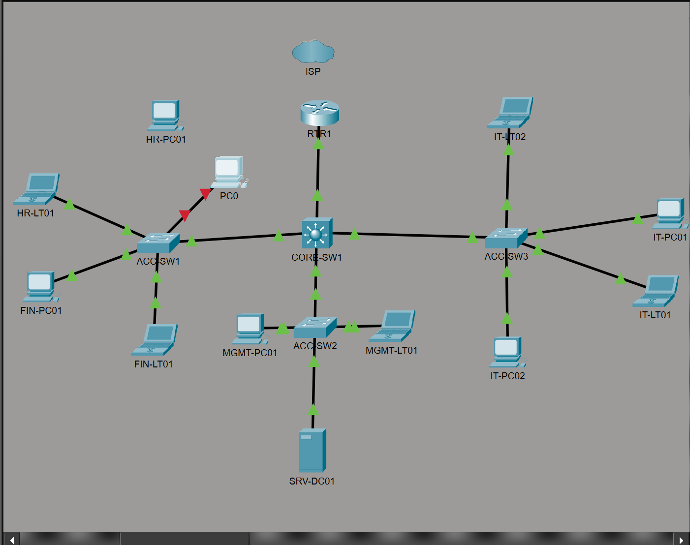
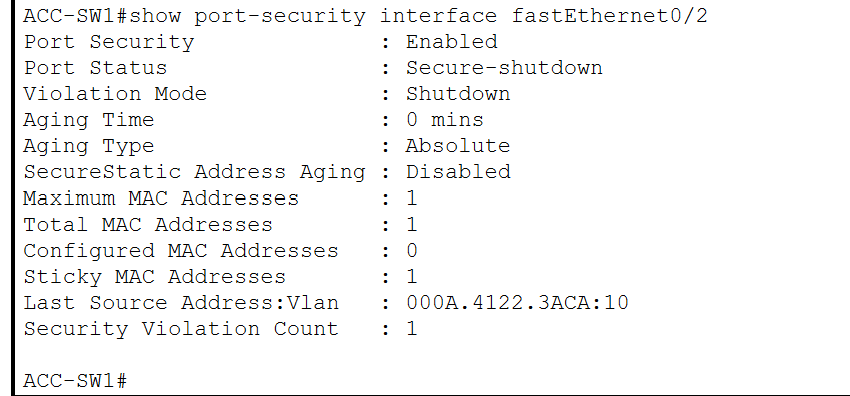

# 10 - Network Verification

## Overview

After completing the enterprise network configuration, a series of verification tests were performed to validate connectivity, network services, remote management, and security. These tests confirm that the network functions as designed and that all implemented technologies operate correctly.

The following components were verified:

- VLAN Connectivity
- Inter-VLAN Routing
- DHCP
- SSH Remote Management
- Port Security

---

# VLAN Verification

Each department was assigned to its own VLAN and IP subnet.

| Department | VLAN | Network |
|------------|------|----------------|
| HR | 10 | 192.168.10.0/24 |
| Finance | 20 | 192.168.20.0/24 |
| IT | 30 | 192.168.30.0/24 |
| Management | 40 | 192.168.40.0/24 |
| Servers | 50 | 192.168.50.0/24 |

Verification Commands

```cisco
show vlan brief
```

Expected Results

- All VLANs present
- Access ports assigned correctly
- End devices located in the proper VLAN

---

# Trunk Verification

Trunk links between the Core Layer 3 switch and each access switch were verified.

Verification Commands

```cisco
show interfaces trunk
```

Expected Results

- Trunk ports operational
- VLANs 10,20,30,40,50 allowed across trunks
- Inter-switch communication functioning correctly

---

# Inter-VLAN Routing Verification

The Layer 3 switch successfully routed traffic between VLANs.

Gateway Interfaces

| VLAN | Gateway |
|------|---------------|
| 10 | 192.168.10.1 |
| 20 | 192.168.20.1 |
| 30 | 192.168.30.1 |
| 40 | 192.168.40.1 |
| 50 | 192.168.50.1 |

Verification

Each department successfully communicated with devices located in different VLANs.

Example

```text
HR-PC01
↓

Default Gateway (192.168.10.1)

↓

CORE-SW1

↓

Finance VLAN

↓

FIN-PC01
```

Verification Commands

```cisco
show ip route
```

```text
ping 192.168.20.100
ping 192.168.30.100
ping 192.168.40.100
ping 192.168.50.10
```

---

# DHCP Verification

DHCP services were verified for every user VLAN.

Clients automatically received:

- IPv4 Address
- Subnet Mask
- Default Gateway
- DNS Server

Verification confirmed that all clients obtained addresses from the correct DHCP scope.

Verification Commands

```text
ipconfig
```

```text
ipconfig /renew
```

Verification Images





---

# Connectivity Verification

End-to-end connectivity was verified using ICMP.

Tests included:

- HR → Finance
- HR → IT
- HR → Management
- HR → Server
- IT → HR
- Finance → Management

Initial pings may experience one timeout while ARP tables populate. Subsequent replies were successful.

Verification Image



---

# SSH Verification

SSH Version 2 was verified by remotely connecting to network devices using the configured administrator account.

Verification confirmed:

- SSH Version 2 enabled
- Local user authentication successful
- Encrypted remote management
- Administrative access functioning correctly

Verification Commands

```text
ssh -l admin 192.168.40.1
```

```cisco
show ip ssh
```

Verification Image



---

# Port Security Verification

Port Security functionality was tested by replacing an authorized workstation with an unauthorized device.

Expected Behavior

1. Authorized device disconnected.
2. Unauthorized device connected.
3. Switch detected a different MAC address.
4. Port entered Secure-Shutdown state.
5. Unauthorized device lost network connectivity.

Verification confirmed:

- Port Security Enabled
- Sticky MAC Address Learned
- Security Violation Count Incremented
- Port Status changed to Secure-Shutdown

Verification Commands

```cisco
show port-security interface FastEthernet0/2
```

```cisco
show port-security address
```

Verification Images





---

# Device Verification Commands

## Switch Verification

```cisco
show vlan brief
show interfaces trunk
show mac address-table
show ip interface brief
show running-config
```

---

## Layer 3 Switch Verification

```cisco
show ip route
show ip interface brief
show running-config
```

---

## DHCP Verification

```text
ipconfig
ipconfig /renew
```

---

## SSH Verification

```text
ssh -l admin <device-ip>
```

```cisco
show ip ssh
```

---

## Port Security Verification

```cisco
show port-security interface FastEthernet0/2
show port-security address
```

---

# Verification Summary

| Feature | Status |
|----------|--------|
| VLAN Configuration | ✅ Verified |
| Trunk Links | ✅ Verified |
| Inter-VLAN Routing | ✅ Verified |
| DHCP | ✅ Verified |
| End-to-End Connectivity | ✅ Verified |
| SSH Remote Management | ✅ Verified |
| Port Security | ✅ Verified |
| Sticky MAC Learning | ✅ Verified |
| Security Violation Testing | ✅ Verified |

---

# Conclusion

Comprehensive verification confirmed that the enterprise network operates as designed. VLAN segmentation, trunking, Layer 3 routing, DHCP, and end-to-end connectivity function correctly across all departments. Security testing demonstrated successful SSH remote management and effective Port Security enforcement, including automatic shutdown of an access port when an unauthorized device attempted to connect.

These verification results validate that the network is fully operational, securely managed, and follows enterprise networking best practices.